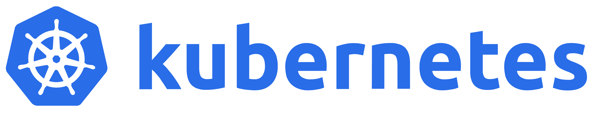

+++
title = 'Kubeception - Setup kubernetes control plane inside another cluster'
date = 2024-05-13T16:54:21+02:00
draft = true
categories = ['Kubernetes', 'Research & Development', 'Containers']
+++

> This is and advanced project which requires a strong knowledge of kubernetes and each of its components.

Official GitHub repository: [github.com/SimonRTC/kubeception](https://github.com/SimonRTC/kubeception)

### What's "Kubeception"?

A "Kubeception" cluster refers to a setup where Kubernetes is run within Kubernetes, essentially nesting one Kubernetes instance inside another. The purpose of such a cluster typically revolves around several key aspects:

- Testing and Development: It provides a robust environment for testing Kubernetes features, configurations, or cluster upgrades in an isolated manner without affecting the main Kubernetes clusters.
- CI/CD Pipelines: Kubeception can be used to dynamically create and destroy Kubernetes clusters as part of CI/CD pipelines, enabling developers to test applications in environments that closely mimic production.
- Education and Training: This setup is excellent for educational purposes, allowing learners to interact with Kubernetes, deploy applications, and manage clusters without needing multiple physical or virtual machines.
- Isolation: It offers an additional layer of isolation, which can be useful for multi-tenant environments where different teams or projects require separate Kubernetes clusters.
- Resource Optimization: By running multiple nested clusters, organizations can optimize their resource usage by dynamically scaling clusters up or down based on demand, all within a controlled Kubernetes environment.

Overall, a Kubeception cluster is a versatile tool for managing Kubernetes instances within Kubernetes, providing flexibility, scalability, and isolation for various Kubernetes-based operations.

### Most famous existing projects
- Azure Kubernetes Service (AKS) with Azure
- Managed Kubernetes Service (EKS) with AWS
- Managed Kubernetes Service (EKS) with OVHcloud

### A little byte of vocabulary
- Target Cluster == Final "customer" cluster with "no" control plane installed inside.
- Administration Cluster == Cluster hosting the multiple control planes of eash target cluster.

### What we need to get started?
Since our environments are ephemeral and need to be constantly created or destroyed, we require a cloud provider (such as Azure, AWS, OpenStack, VMware Cloud Director, etc.). This choice is not irreversible but needs to be seriously considered before getting started.

We also need a administration cluster to deploy each or our future control planes. This cluster is not really important during the development phase. I personally use Azure AKS or a local kubeadm to deploy my control planes.

I've choose to use Helm (for every components deployed inside of the target cluster), Ansible (to create the target cluster nodes image) and OpenStack (as cloud provider).

--

So basically:
- A cloud provider
- An administration cluster
- A pretty good knowledge of Ansible, Helm and a programming langladge (such Golang or Python).

---

> **This post is a draft! I working on it... :)**